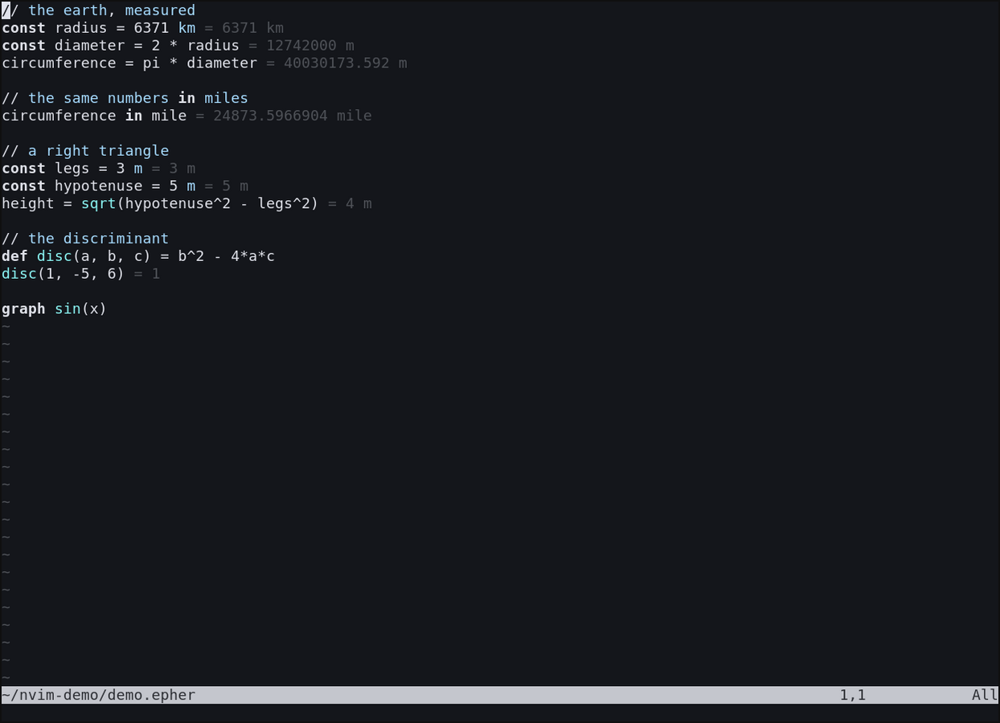
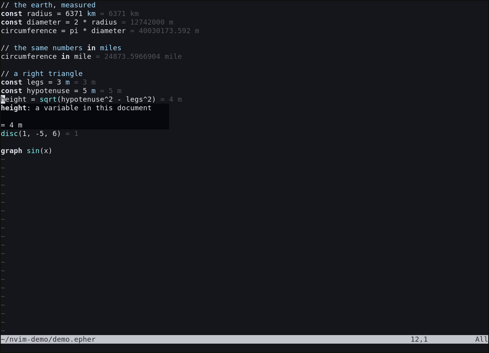
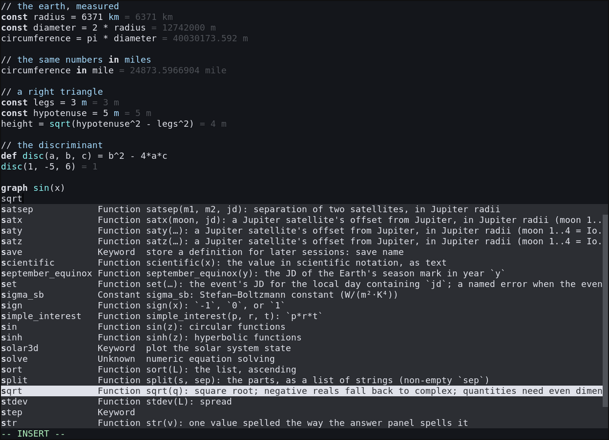
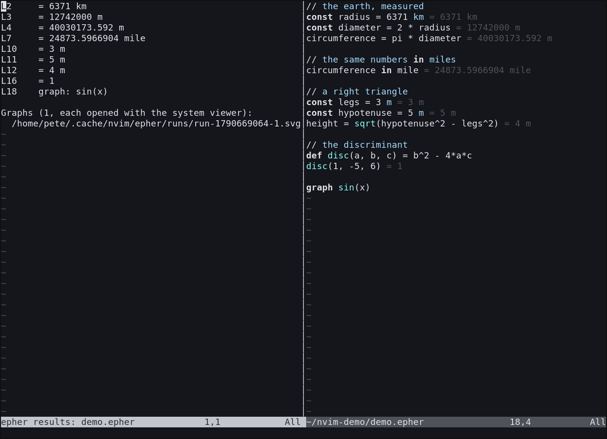

# epher for Neovim

**epher** is a calculator language: you write ordinary math, with units
that convert, and every statement's answer appears inline, right next
to the line that produced it. This is the native LSP glue for the
shared `epher-lsp` server. The filetype detection and syntax files
are the shared runtime from `clients/vim`, synced into this directory
by `sync-runtime.py`.

Download the [epher calculator](https://epher.org), and a large
selection of [ready-made scripts](https://epher.org/scripts.html) from
epher.org.




Type a formula and the answer is already there. No runnable repl in a
side panel, no print statements: the editor *is* the calculator.

## What you get

- **Answers inline**: each statement's result renders next to its
  line: `x = 40 + 2` shows `= 42`. Neovim's own inlay-hint engine
  renders them, so this needs Neovim 0.11 or newer; 0.9 and 0.10 show
  the answers in the results window instead.
- **Units that convert**: `6371 km`, `55 mile/hr`, `30 deg` are
  quantities, not comments. `speed in km/hr` converts; the answer
  carries the right unit.
- **Live diagnostics**: syntax errors point at the exact token, and
  evaluation errors carry the same message the epher calculator shows.
- **Hover signatures**: hover any name for its canonical signature;
  your own functions show their definitions, catalog functions show
  their docs.



- **Completion**: the whole catalog (math, astronomy, statistics),
  your own definitions, keywords, and snippets for the common
  statement shapes.



- **Definition jumps**: `<C-]>`-style jumps for names defined in the
  file.
- **Run the script**: `:EpherRun` sends the same `epher/run` request
  the VS Code results pane uses and opens a results window beside the
  script, one row per statement, errors marked. `<CR>` on a row jumps
  to its statement; `<CR>` on a graph row reopens its SVG; rerunning
  from the results window re-runs the script. `setup({ pane = "float"
  })` puts the results in a floating window instead of a vertical
  split.



- **Highlighting**: Neovim's syntax engine does not consume LSP
  semantic tokens today, so coloring comes from the shared regex
  syntax in `clients/vim`, the conservative approximation of the
  parser's unit rule.

## Install

With [lazy.nvim](https://github.com/folke/lazy.nvim):

```lua
{
  "upyesp/epher.nvim",
  config = function()
    require("epher").setup({ cmd = { "epher-lsp" } })
  end,
}
```

From luarocks.org with rocks.nvim:

```vim
:Rocks install epher
```

Then set up the server once:

```lua
require("epher").setup({
  cmd = { "epher-lsp" },  -- or a full path
})
```

The rock packages this directory plus the shared runtime files, so
rocks.nvim's runtimepath handling finds the ftdetect, ftplugin, and
syntax directories. rocks.nvim requires Neovim 0.10 or newer.

From an epher checkout, the same files live at `clients/nvim`:

```lua
-- anywhere in your config, after lazy-loading is fine
vim.opt.rtp:append("/path/to/epher/clients/nvim")

require("epher").setup({
  cmd = { "/path/to/epher-lsp" },  -- or just {"epher-lsp"} if on PATH
})
```

`clients/nvim` carries the synced runtime files itself, so appending
only `clients/nvim` is enough; appending `clients/vim` as well (the
original two-path setup) keeps working unchanged.

## Getting the server binary

Required prerequisite: epher-lsp. Without it, Neovim only highlights
.epher files — the inline answers, diagnostics, hover, and the results
window all come from the server. Download the asset for your operating
system from the
[releases page](https://github.com/upyesp/epher/releases/latest),
uncompress it, and mark it executable:

```sh
# linux x86_64 (arm64 and macos-aarch64 analogous)
curl -LO https://github.com/upyesp/epher/releases/latest/download/epher-lsp-linux-x86_64.gz
gunzip epher-lsp-linux-x86_64.gz && mv epher-lsp-linux-x86_64 ~/.local/bin/epher-lsp
chmod +x ~/.local/bin/epher-lsp

# windows (powershell): epher-lsp-windows-x86_64.zip -> epher-lsp.exe
```

First download needs the network once; the server runs entirely
locally after that.

## Requirements

- Neovim 0.9 or newer for the glue. Inline answers need 0.11 or
  newer; the `:Rocks install` path needs rocks.nvim, which requires
  Neovim 0.10 or newer.
- The `epher-lsp` binary for your platform, on PATH or named in
  `setup`.
- The filetype and syntax files from `clients/vim`; `clients/nvim`
  carries synced copies of them, and both install paths use those
  copies.

## Data and telemetry

None. Everything evaluates on your machine.

## License

[MIT](https://github.com/upyesp/epher/blob/main/LICENSE)

## Maintainer note

This repository is a synced mirror of `clients/nvim` in
[upyesp/epher](https://github.com/upyesp/epher), assembled by
`clients/nvim/listing/assemble-repo.sh` on every epher release train;
its tags mirror the monorepo's `v*` tags. Do not edit here: changes
land in the monorepo first.
