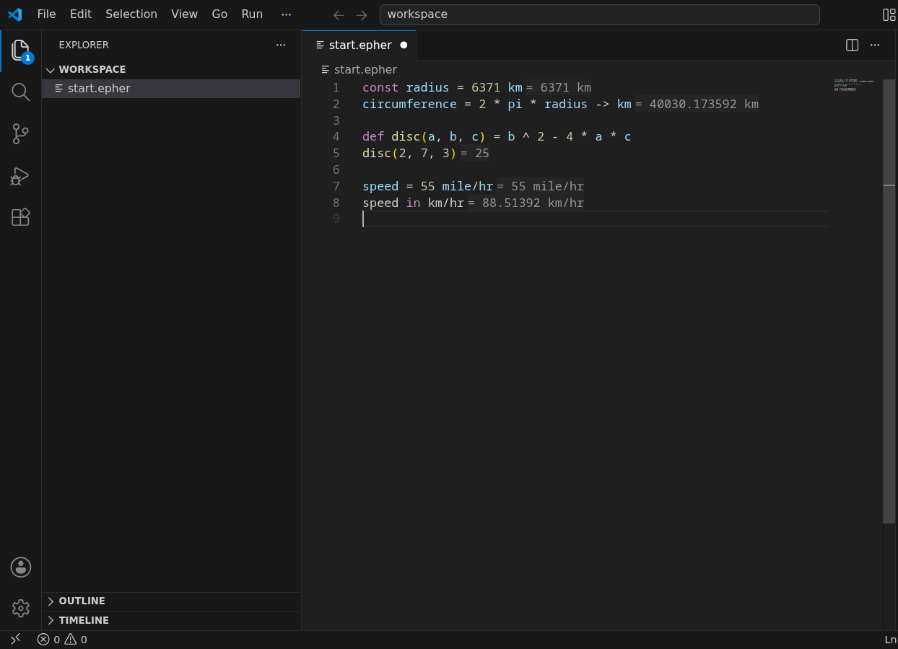

# Epher for Visual Studio Code

**epher** is a calculator language: you write ordinary math — with units
that convert — and every statement's answer appears inline, right next
to the line that produced it.

Type a formula and the answer is already there. No runnable repl in a
side panel, no print statements — the editor *is* the calculator.

## What you get

- **Answers inline** — each statement's result renders next to its
  line: `x = 40 + 2` shows `= 42`.
- **Units that convert** — `6371 km`, `55 mile/hr`, `30 deg` are
  quantities, not comments. `speed in km/hr` converts; the answer
  carries the right unit.
- **Live diagnostics** — syntax errors point at the exact token, and
  evaluation errors carry the same message the epher calculator shows.
- **Hover signatures** — hover any name for its canonical signature;
  your own functions show their definitions, catalog functions show
  their docs.

- **Completion** — the whole catalog (math, astronomy, statistics),
  your own definitions, keywords, and snippets for the common
  statement shapes.

- **Unit-aware coloring** — semantic tokens color unit suffixes by
  meaning: the `m` in `2 m` is a unit, not a variable.

## Quick start

1. Get `epher-vscode.vsix` from the
   [releases page](https://github.com/upyesp/epher/releases/latest).
2. In VS Code: **Extensions** view → the `⋯` menu → **Install from
   VSIX…** — pick the file. (The wasm-wasi runtime it rides on
   installs itself as a dependency.)
3. Open any `.epher` file and start calculating.

The language server ships **inside the extension** — a WebAssembly
build of the same `epher-lsp` server the other editors use. Nothing is
downloaded on first use, and it works offline.

## Works in the browser too

The same extension runs on [vscode.dev](https://vscode.dev) and
github.dev — press <kbd>.</kbd> on any GitHub repository to open it in
the browser, with the same inline answers.

## Requirements

- VS Code `1.88` or newer (and the forks: Cursor, VSCodium; or a web
  host). The `ms-vscode.wasm-wasi-core` runtime installs automatically
  with the extension.
- No other setup: no compiler, no runtime, no network after install.

## Where the other editors fit

Every epher extension speaks the same language server (ADR-0066):

| Editor | How it gets the server |
| --- | --- |
| VS Code, Cursor, VSCodium, vscode.dev | ships inside the extension (WebAssembly) |
| JetBrains IDEs, Visual Studio 2022 | downloaded on first use, then cached |
| Zed, Neovim, Vim, Sublime, Emacs, Eclipse | points at an `epher-lsp` on your `PATH` |

## Troubleshooting

If the server cannot start, editing still works through the TextMate
baseline (highlighting and snippets); only the live features wait. A
window reload retries. The **Output** panel's **Epher** channel says
what happened.

## Data and telemetry

None. Everything evaluates on your machine.

## License

[MIT](https://github.com/upyesp/epher/blob/main/LICENSE)

---

<strong>Building and contributing (extension developers)</strong>

The extension is a thin shell; all understanding lives in
<a href="https://github.com/upyesp/epher/tree/main/crates/lsp">epher-lsp</a>,
the shared language server. The grammar (`syntaxes/epher.tmLanguage.json`)
and snippets (`snippets/epher.json`) are copies of
<a href="https://github.com/upyesp/epher/tree/main/clients/shared">clients/shared</a>
— edit there, never the copies.

    npm install
    npm run compile          # syncs shared assets, typechecks, bundles both entries
    npx @vscode/vsce package --no-dependencies

`npm run compile` bundles the desktop entry to `out/extension.js` and
the web entry to `dist/browser.js` with esbuild (single file each —
the web worker allows no module loading) and typechecks both.

The wasm must be in place first (CI does this before packaging; the
wasm is never checked in):

    rustup target add wasm32-wasip1-threads
    cargo build -p epher-lsp --target wasm32-wasip1-threads --release
    mkdir -p server
    cp ../../target/wasm32-wasip1-threads/release/epher-lsp.wasm server/

Marketplace publication is deliberately out of scope until the
extensions are proven (ADR-0068); the releases page is the
distribution for now.

