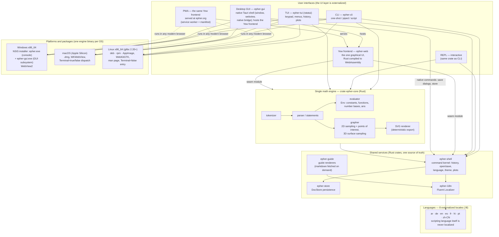
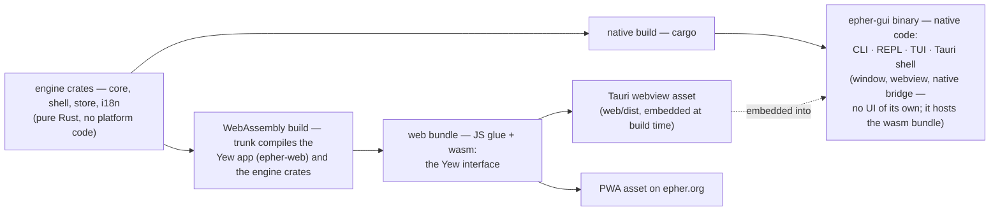

# epher architecture

One math engine, every interface. This document describes the runtime
architecture of epher — a programmable calculator whose engine is a
single Rust crate, compiled to native code for the terminal frontends
and to WebAssembly for the browser-based frontends — the desktop GUI's
interface is that same WebAssembly build, not a separate native UI. All user-facing
text lives in externalized Fluent locale files covering 8 languages.

> Drafted for the website but not yet linked there; edit freely.

## Overview

## Compilation targets

## Explanatory notes

**The engine.** `epher-core` holds the tokenizer, parser, evaluator, and
both graphers (2D curve sampling with points-of-interest analysis, 3D
surface sampling), plus the deterministic SVG renderer. It has no UI
code and, since ADR-0037, exactly one platform read (`now()`'s clock) —
every frontend calls the same functions, so
`2 + 2` and `graph x ^ 2` mean the same thing in every interface.

**Shared services.** `epher-shell` is the command kernel used by every
frontend that has commands (history, open/save, `language`, `theme`,
plot assembly). `epher-store` persists documents (`DocStore<FsStore>`
→ `~/.epher/` on desktop and TUI, a browser `localStorage` adapter in
the PWA). `epher-i18n` is a Fluent `Localizer` over externalized `.ftl`
files. `epher-guide` is the user guide's renderers (markdown → HTML for
the web/desktop overlay, markdown → plain text for the TUI pager); the
markdown itself is not compiled into any binary — the web app fetches
`guide/<locale>.md` from its static files, and the TUI reads the
installed files when the guide opens (ADR-0053).

**Terminal frontends (native).** `epher-cli` is the one-shot/piped
expression evaluator and the REPL. `epher-tui` is the full-screen
ratatui app: keypad, menus, clickable history, 2D/3D plots. Both link
the engine as an ordinary Rust dependency.

**Browser frontends (WebAssembly).** `epher-web` is the Yew
single-page app — the one and only graphical interface. Trunk compiles
it, together with the engine, shell, store, and i18n crates, to
WebAssembly and bundles the result with the UI glue and a service
worker: that bundle *is* the PWA at epher.org **and** the desktop GUI.
The **desktop GUI** (`epher-gui`, the Tauri app) has no native UI of
its own: it contributes only a shell — window, system webview, and a
thin bridge of native commands (save dialogs, filesystem store) — and
embeds the same wasm bundle as its content (`frontendDist: web/dist`,
built by `trunk build --release`). The desktop calculator and the PWA
are two ways to serve one Yew codebase.

**One binary, three terminals.** On macOS and Linux a single
`epher-gui` binary decides by how it was launched (and by the
`Terminal=` desktop entry) whether to run the CLI/REPL, the TUI, or the
Tauri window. On Windows the NSIS installer ships two subsystem builds
of the same program: `epher.exe` for the console and `epher-gui.exe`
for double-click launching.

**Platforms.** Windows x86_64 via a themed NSIS installer (WebView2);
macOS Apple Silicon via an unsigned `.dmg` (WKWebView); Linux x86_64 as
deb, rpm, and AppImage built on glibc 2.35 (WebKitGTK), with a man page
and a `Terminal=false` desktop entry. The PWA runs anywhere a modern
browser does.

**Languages.** Every string the interfaces show comes from one of the
8 externalized Fluent locales (ar, de, en, es, fr, hi, pt, zh-CN) —
the UI is translated, the scripting language is deliberately never
localized, and diagnostics stay byte-identical across locales.
